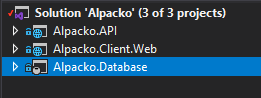
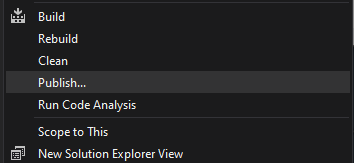
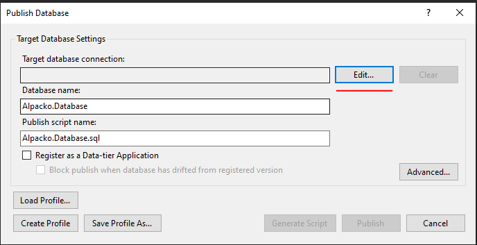
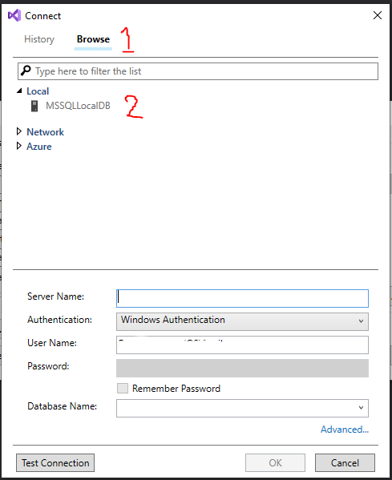
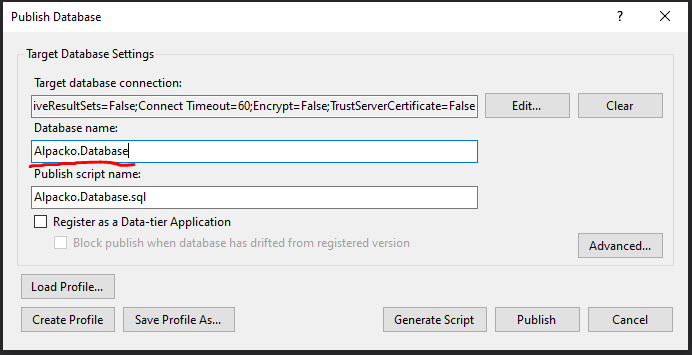

___
# Alpacko usage GUIDE

The first-time user have to setup a database in order to be able to run this application
follow these steps to create an Alpacko Database on your local pc.

## Step 1.  
When you first open the project, go to the Solution Explorer and find Alpacko.Database.  
  
Right-click on Alpacko.Database and click "Publish"  

## Step 2.  
A window named "Publish Database" will open.  
At Target database connection select the button called "Edit" this will open up a new window named "connect"  
Here select the tab "Browse" (1) and then expand the "Local" tree. 
When expanded, you will see a server named "MSSQLLocalDB".(2) Select that server.  
Click "OK"  
The window will close down.  
On this "Publish Database" window at "Database Name"   
Make sure you name the database "Alpacko.Database" and then Click on "Publish".   

Now you can run the application.  
**!NOTE!**: Make sure you select multiple startup projects! __Alpacko.Client.Web__ and __Alpacko.API__ have to launch at the same time.
___
# Create Dummy Data in Database

In order to create some dummy-data in the database to try out the application, switch to the branch named [165-automatically-create-dummy-data](https://github.com/Abooow/Alpacko/tree/165-automatically-create-dummy-data) and run it.  

## This data is thats going to be created:
* 2 Users  

   | **Email**             | **Password** | **Role**  |
   | ----------------- | -------- | ----- |
   | admin@alpacko.com | password | Admin |
   | user@alpacko.com  | password | User  |
 
   *\* these e-mailaddresses are not real*  
   The user with the admin role will be connected to a postoffice named Alpacko. He is allowed to access the register packages page.  
* 10 Packages  
* 1 Package Detail
* 1 Package Sender
* 1 Package Recipient
* 1 Package SizeName
* 1 Post Office
* 2 UserRole

